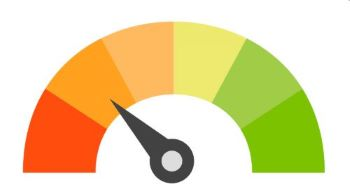

# Credit Risk Classification - Project Overview
Supervised learning and classification methods were used to train and evaluate two different models (Logistic Regression with Original Data and Logistic Regression with Resampled Data) to predict borrower creditworthiness. 
 

<!-- 

 -->
<!--  -->

<!-- 
 
 -->

## <u> Credit Risk Analysis Report </u>

### <b> Purpose </b>
The purpose of the analysis is to predict the creditworthiness of borrowers by using historical financial data from a peer lending organization. The following report will detail the data used, the methodology, and the results of the analysis.

### <b> Dataset </b>
The following financial information was used in the analysis:
<li> Loan Size </li>
<li> Interest Rate </li>
<li> Borrower Income </li>
<li> Debt to Income Ratio </li>
<li> Number of Accounts </li>
<li> Derogatory Marks </li>
<li> Total Debt </li>
<li> Loan Status </li>
 

### <b> Methodology </b>
Jupyter Notebook and Python were used to read the CSV data into a Pandas DataFrame. The "Loan Status" was selected as the variable for the analysis, with 0 indicating a healthy loan and 1 indicating a high-risk loan. The following two models were used for the analysis:

Logistic Regression Model with Original Data
<li> Data split into training and testing sets via 'train_test_split' </li>
<li> Logistic Regression Model created with the original data - accuracy score 99% </li>
<li> Predictions made and saved to Pandas DataFrame - balanced accuracy score 95%</li>
 

Logistic Regression Model with Resampled Data
<li> Training Data used to resample via 'RandomOverSampler' </li>
<li> 'value_counts' used to ensure "Loan Status" has an equal number of data points </li>
<li> Predictions made via 'LogisticRegression' classifier - balanced accuracy score 95% </li>

## Results
Below are the scores of all machine learning models used during the analysis:

<u> Logistic Regression Model with Original Data </u>
<li> Balanced Accuracy Score 95.205% </li>
<li> Training Accuracy Score 99.212% </li>
<li> Training Precision Macro Avg Score 93% </li>
<li> Training Recall Macro Avg Score 95% </li>
<li> Training f1-Macro Avg Score 94% </li>
<li> Training Precision Weighted Avg Score 99% </li>
<li> Training Recall Weighted Avg Score 99% </li>
<li> Training f1-Weighted Avg Score 99% </li>
<li> Testing Accuracy Score 99.185% </li>
<li> Testing Precision Macro Avg Score 92% </li>
<li> Testing Recall Macro Avg Score 95% </li>
<li> Testing f1-Macro Avg Score 94% </li>
<li> Testing Precision Weighted Avg Score 99% </li>
<li> Testing Recall Weighted Avg Score 99% </li>
<li> Testing f1-Weighted Avg Score 99% </li>
 

<u> Logistic Regression Model with Resampled Data </u>
<li> Resampled Accuracy Score 94.941% </li>
<li> Resampled Precision Macro Avg Score 95% </li>
<li> Resampled Recall Macro Avg Score 95% </li>
<li> Resampled f1-Macro Avg Score 95% </li>
<li> Resampled Precision Weighted Avg Score 95% </li>
<li> Resampled Recall Weighted Avg Score 95% </li>
<li> Resampled f1-Weighted Avg Score 95% </li>
 

## Summary
Based on the scores of the Logistic Regression Model using origina data, the model's performance remained stable with minimal differences amonst the scores. This is as expected; the model is performing well on data it hasn't seen before. Since it is also returning strong precision and recall scores, this is a good indication that the model will perform moving forward.

Based on the scores of the Logistic Regression Model using resampled data, the model's performance seems to be impacted by noise and bias, and perhaps model selection issues. The resampled data may have created oversampling, making it harder for the model to distinguish between the two classes; healthy and high-risk. Also, oversampling of the high-risk class may cause the model to be biased towards that class, thereby leading to decreased overall accuracy.

For purposes of this analysis, however, and based on the data and scores for the two models, the difference is nominal; both models appear relatively equal in performance and both result in an overall accuracy score of 95%. If the data were to change, or a different variable selected; the results may differ and it might perhaps be advisable to select alternate models (e.g., SVMs or Random Forests).

## Resources
#### Data Source: lending_data.csv
#### Software/Tools: Jupyter, Python, Pandas, Numpy, Sklearn, Imblearn, VSCode